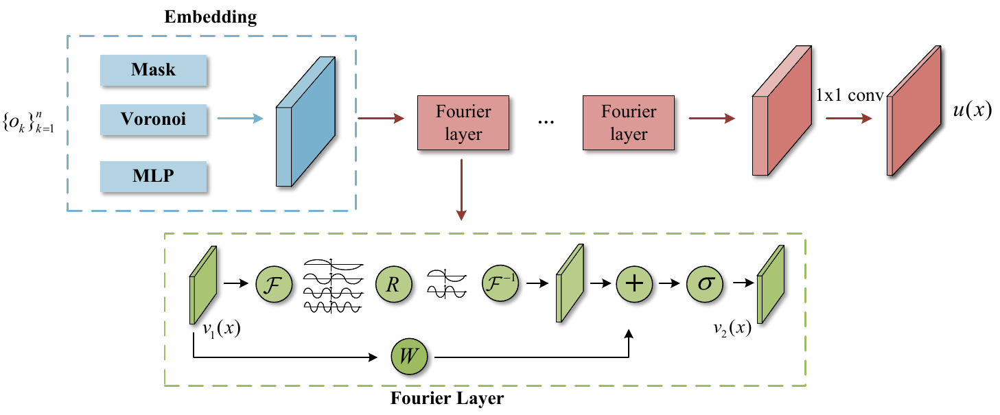
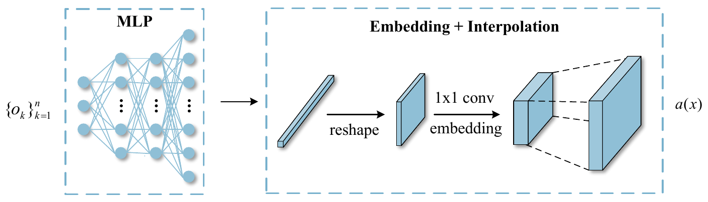
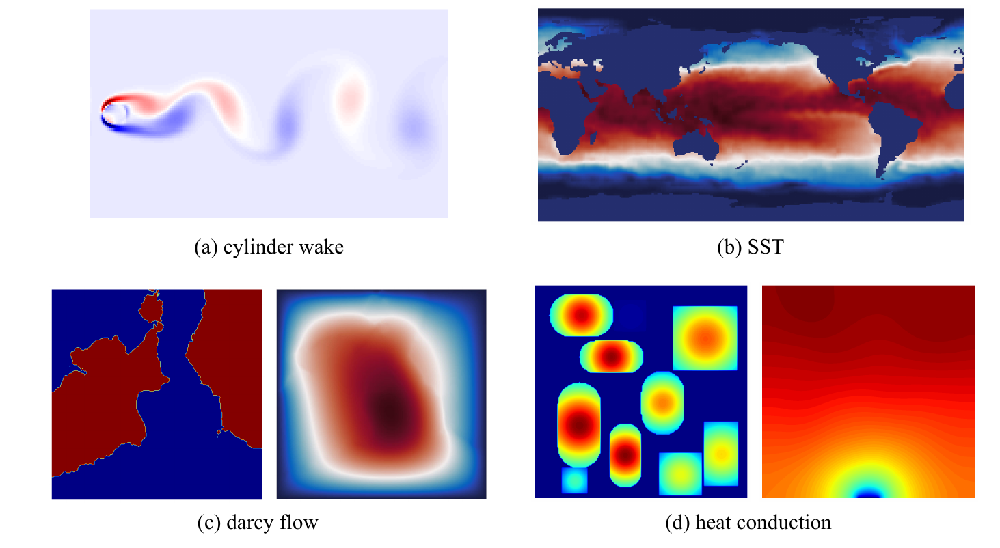
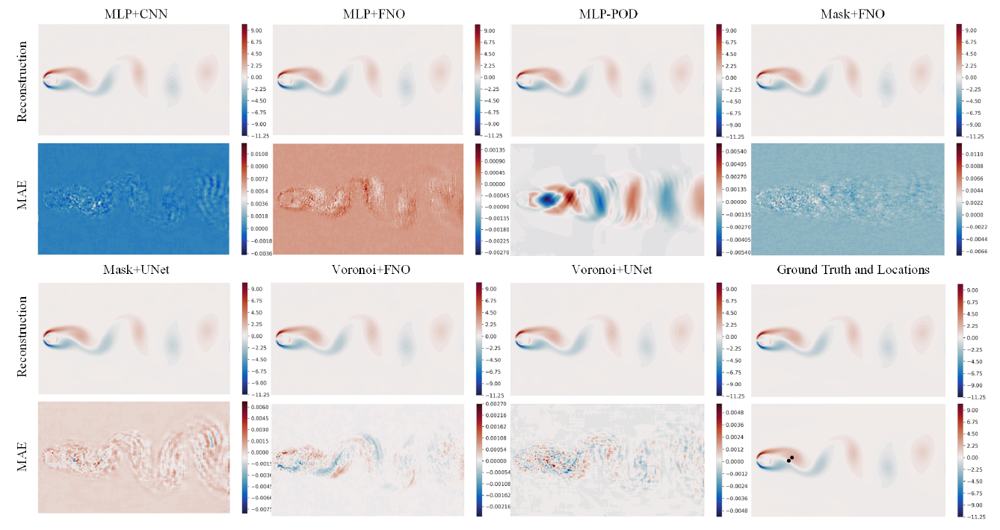
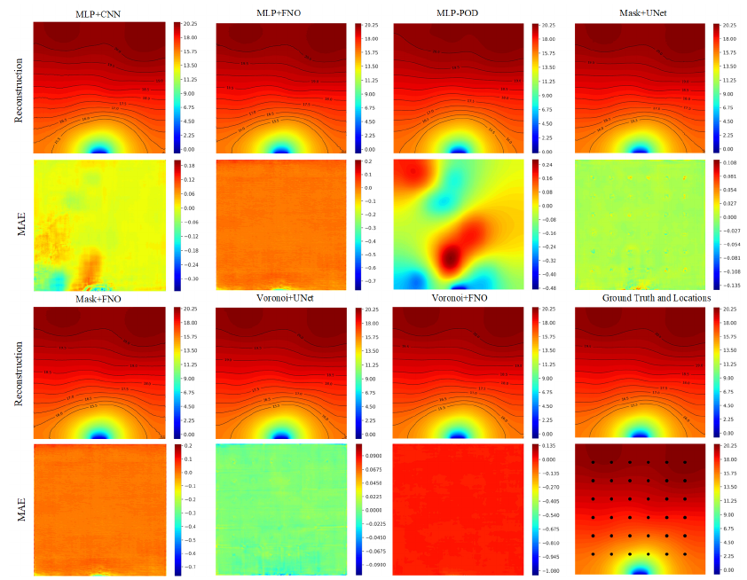
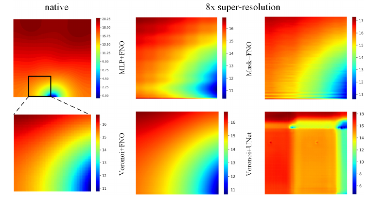
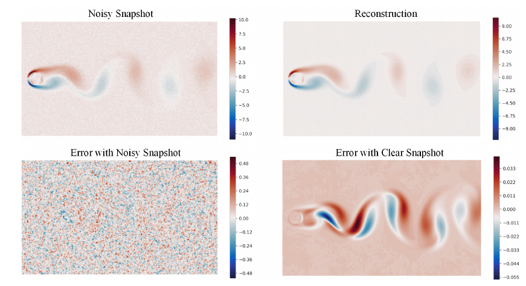

# Fourier neural operator for flow and heat field reconstruction
This is the implementation of ‘’RecFNO: a resolution-invariant flow and heat field reconstruction method from sparse observations via Fourier neural operator“

- The pipeline of the proposed RecFNO. The RecFNO architecture is composed of an embedding module and multiple Fourier layers.





- Illustrations of four datasets used in this paper. The datasets consists of 2D cylinder wake, 2D steady-state darcy flow, sea surface temperature, and 2D steady-state heat conduction.



- Visualization of reconstructed vorticity and absolute reconstruction error from 2 observations on cylinder wake dataset.



- Visualization of reconstructed temperature field and absolute reconstruction error from 25 observations on heat conduction dataset. The black dots on the last image represent locations of sensor.



- Illustrations of zero-shot super-resolution reconstruction on heat conduction dataset.



- Visualization of the results using noisy snapshots. The noise level is 10 SNR.



# Usage

## Environment

```shell
torch=1.12.1+cu113
torchvision=0.13.1+cu113
tensorboard
scipy
h5py
```

## Data Preparation

Please download the dataset to your local drive, and modify the path of dataset in the $dataset.py$.

- [2D Cylinder Wake](https://nudteducn-my.sharepoint.com/:f:/g/personal/zhaoxiaoyu13_nudt_edu_cn/EsMGFk8x6CRMqastVlVu1zcBORqDbFhOupb1AyjSzW3uoA?e=62iInH).
- [2D Steady-state Darcy Flow](https://nudteducn-my.sharepoint.com/:f:/g/personal/zhaoxiaoyu13_nudt_edu_cn/Ej1zzrkHJMpOiRIdNEIoEGUBjmOQ_MyeR7_9qH4p0m5HEg?e=F1NFYp).
- [Sea Surface Temperature Dataset](https://nudteducn-my.sharepoint.com/:f:/g/personal/zhaoxiaoyu13_nudt_edu_cn/EsxKkhJR9P1Hk0LP3UXL4GABz0t_fp3wLATHkYk99R7vxQ?e=e0XZp9).
- [2D Steady-state Heat Conduction](https://nudteducn-my.sharepoint.com/:f:/g/personal/zhaoxiaoyu13_nudt_edu_cn/ElHePUBS_gpIjr240jcrdZ4BhMKsA3DBeYWLS6Roq_52TA?e=RZKOh5).

## Train and Test

Enter the folder of the corresponding dataset, and run the code with python. 

# Reference

The project is built upon [Fourier neural operator]( https://github.com/neuraloperator/neuraloperator) and [Voronoi-CNN](https://github.com/kfukami/Voronoi-CNN).

- neuraloperator: https://github.com/neuraloperator/neuraloperator
- Voronoi-CNN: https://github.com/kfukami/Voronoi-CNN

Thank for their excellent works.

# Citation

If you find our codes or models useful, please consider to give us a star or cite with:

```
@misc{https://doi.org/10.48550/arxiv.2302.09808,
  doi = {10.48550/ARXIV.2302.09808},
  url = {https://arxiv.org/abs/2302.09808},
  author = {Zhao, Xiaoyu and Chen, Xiaoqian and Gong, Zhiqiang and Zhou, Weien and Yao, Wen and Zhang, Yunyang},
  title = {RecFNO: a resolution-invariant flow and heat field reconstruction method from sparse observations via Fourier neural operator}, 
  publisher = {arXiv},
  year = {2023},
  copyright = {arXiv.org perpetual, non-exclusive license}
}
```

